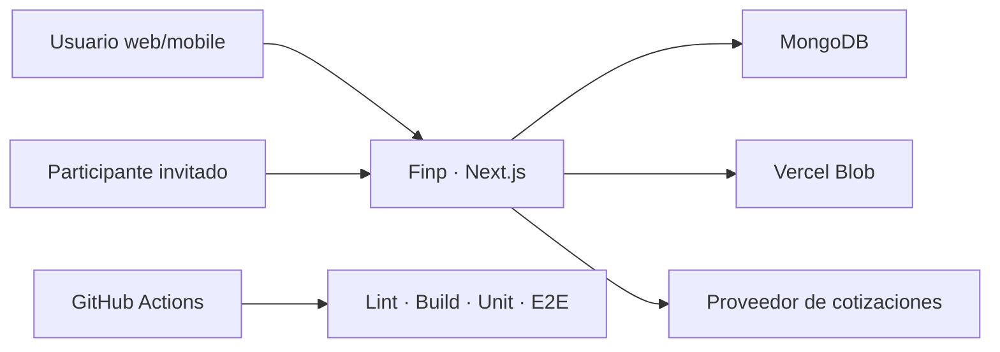
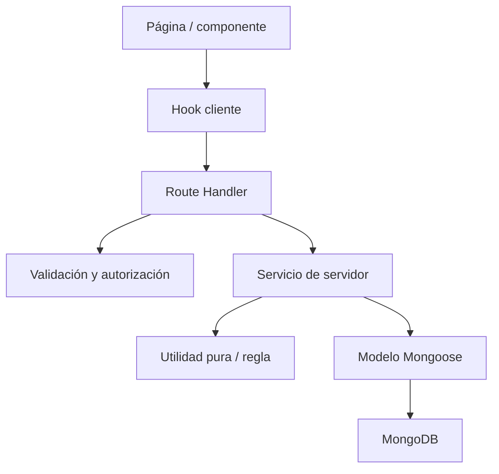

# Arquitectura técnica de Finp

> Estado: vigente
> Audiencia: desarrollo, arquitectura, calidad y agentes
> Última actualización: 2026-07-28
> Fuente de verdad: estructura técnica, límites y fuentes de datos

## Índice

1. [Objetivo](#1-objetivo)
2. [Contexto del sistema](#2-contexto-del-sistema)
3. [Stack](#3-stack)
4. [Estructura del repositorio](#4-estructura-del-repositorio)
5. [Capas y dependencias](#5-capas-y-dependencias)
6. [Flujo de una operación](#6-flujo-de-una-operación)
7. [Fuentes de verdad por dominio](#7-fuentes-de-verdad-por-dominio)
8. [Servicios de servidor](#8-servicios-de-servidor)
9. [Persistencia](#9-persistencia)
10. [Consistencia y atomicidad](#10-consistencia-y-atomicidad)
11. [Autenticación, autorización y privacidad](#11-autenticación-autorización-y-privacidad)
12. [Cliente, cache e invalidación](#12-cliente-cache-e-invalidación)
13. [Errores y observabilidad](#13-errores-y-observabilidad)
14. [Automatización y aprendizaje](#14-automatización-y-aprendizaje)
15. [Rendimiento](#15-rendimiento)
16. [Migraciones y compatibilidad](#16-migraciones-y-compatibilidad)
17. [Plataforma futura](#17-plataforma-futura)
18. [Reglas de evolución](#18-reglas-de-evolución)

## 1. Objetivo

Este documento describe cómo se organiza Finp y dónde deben vivir las responsabilidades. La especificación funcional define comportamiento; este documento evita duplicación, acoplamiento y fuentes de verdad contradictorias.

## 2. Contexto del sistema



Finp es actualmente un monolito modular:

- una aplicación Next.js;
- UI y API en el mismo repositorio;
- MongoDB como persistencia principal;
- servicios de dominio compartidos en servidor;
- integraciones externas acotadas.

No existe hoy:

- backend separado;
- cola de eventos;
- scheduler operativo;
- realtime;
- base local sincronizada;
- cliente mobile nativo.

## 3. Stack

| Área | Tecnología |
|---|---|
| Framework | Next.js App Router 16 |
| UI | React 19, TypeScript, Tailwind CSS, Radix/shadcn y componentes propios |
| Formularios | React Hook Form y Zod |
| Persistencia | MongoDB y Mongoose |
| Autenticación | NextAuth v5 beta |
| Datos cliente | Hooks propios, fetch e invalidación por tags |
| Visualización | Recharts, D3 y d3-sankey |
| Archivos | ExcelJS/xlsx y Vercel Blob |
| Unit/integration | Vitest y Testing Library |
| E2E | Playwright |
| CI | GitHub Actions |

La versión exacta vive en `package.json` y `package-lock.json`.

## 4. Estructura del repositorio

```text
src/
├── app/
│   ├── (app)/              páginas autenticadas
│   ├── (auth)/             login y registro
│   └── api/                Route Handlers
├── components/
│   ├── ui/                 primitivas
│   ├── shared/             componentes de producto reutilizables
│   └── <dominio>/          composición por módulo
├── contexts/               contexto React global
├── hooks/                  acceso cliente e interacción
├── lib/
│   ├── client/             sincronización y utilidades cliente
│   ├── constants/          constantes compartidas
│   ├── db/                 conexión
│   ├── models/             modelos Mongoose
│   ├── server/             servicios de servidor y dominio
│   ├── utils/              lógica pura
│   └── validations/        esquemas de entrada
└── types/                  contratos compartidos
```

Tests:

```text
tests/
├── unit/
├── e2e/
└── helpers/
```

## 5. Capas y dependencias

Dirección esperada:



Reglas:

- componentes no importan modelos Mongoose;
- hooks no contienen reglas financieras;
- Route Handlers no duplican servicios;
- servicios coordinan autorización de recursos, dominio y persistencia;
- utilidades puras no acceden a red ni base;
- validaciones representan contratos de entrada, no decisiones completas de negocio;
- tipos compartidos no deben arrastrar dependencias de servidor al cliente.

Una excepción necesita justificación y, si crea precedente, una decisión.

## 6. Flujo de una operación

### Consulta

1. UI solicita datos mediante hook o fetch.
2. Route Handler autentica.
3. Servicio filtra por usuario y permisos.
4. Modelos leen datos.
5. Servicio transforma a un contrato seguro.
6. Cliente presenta y conserva estados de carga/error.

### Mutación

1. UI recoge intención.
2. Cliente puede validar para feedback.
3. Servidor vuelve a validar.
4. Se autentica y autoriza el recurso.
5. Servicio resuelve reglas e invariantes.
6. Se escriben cambios atómicos si corresponde.
7. Se generan efectos derivados idempotentes.
8. Se devuelve resultado.
9. Cliente invalida tags relacionados.
10. UI confirma impacto o error.

La preview ejecuta resolución sin persistir. La confirmación vuelve a validar datos que pudieron cambiar.

## 7. Fuentes de verdad por dominio

| Dominio | Fuente principal | Regla |
|---|---|---|
| Usuario/preferencias | `User` | Aislamiento por identidad autenticada. |
| Saldo de cuentas | transacciones + saldos iniciales | No guardar un saldo derivado como autoridad paralela. |
| Movimiento personal | `Transaction` | Tipo y vínculos determinan efecto. |
| Resumen de tarjeta | transacciones del período + `credit-card.ts` | Total, pagado, pendiente y crédito se derivan por tarjeta y moneda; nunca se suman ARS y USD. |
| Grupo de pago dual | `Transaction.paymentGroupId` | Vincula una intención de pago; el usuario elige el alcance del borrado y un grupo con menos de dos miembros se normaliza. |
| Cuotas | `InstallmentPlan` + transacciones relacionadas | Evitar doble impacto. El plan vive mientras exista su compra originaria: eliminar una arrastra la otra. |
| Compromiso | `ScheduledCommitment` | Plantilla, política y agenda. |
| Aplicación | subdocumento/relación de compromiso | Snapshot por período y transacción. |
| Regla | `TransactionRule` | Servicio compartido resuelve coincidencia y acciones. |
| Aprendizaje | perfil, eventos, alias y control de patrones | Menor autoridad que entrada explícita y reglas. |
| Espacio | `Space`, participantes y movimientos | Contexto compartido. |
| Impacto personal | `SpaceEntryPersonalImpact` | Privado por usuario; no usar estado global `linked`. |
| Deuda | `Debt` + `DebtMovement` | Manual o derivada; pagos sin impacto operacional. |
| Notificación | `Notification` | Información y presentación. |
| Pendiente | entidad de acción correspondiente | No se resuelve por leer notificación. |

## 8. Servicios de servidor

Servicios relevantes en `src/lib/server/`:

| Grupo | Responsabilidad |
|---|---|
| `transactions.ts` | creación y edición de movimientos con reglas comunes |
| `transaction-teardown.ts` | limpieza de relaciones antes de eliminar, incluida la cascada del plan de cuotas y normalización de grupos de pago |
| `commitments*.ts` | políticas de monto, contexto, matching y aplicación |
| `projection.ts` | proyección compartida por API y superficies |
| `quick-capture*.ts` | contexto, preview, aprendizaje y feedback |
| `spaces.ts` y `space-*.ts` | permisos, movimientos, actividad, invitaciones e impacto |
| `debt-sync.ts` | materialización idempotente desde Espacios |
| `debt-settlement.ts` | pago/cobro atómico |
| `notifications.ts` | creación, dedupe y resolución |
| `nav-insights.ts` | señales de navegación |
| `errors.ts` | errores de servicio traducibles por API |

Antes de crear un servicio:

1. buscar una responsabilidad equivalente;
2. extender la fuente común;
3. evitar una versión “especial” en un endpoint;
4. agregar tests sobre el servicio compartido.

## 9. Persistencia

### Modelos

Mongoose modela entidades principales y relaciones por identificador. Los modelos deben:

- definir índices según consultas reales;
- incluir `userId` o contexto de autorización;
- evitar campos derivados como autoridad duplicada;
- validar enums y estados;
- preservar compatibilidad durante migraciones.

### Cache de modelos

En desarrollo, Mongoose puede conservar modelos compilados. Al agregar campos se debe revisar el guard de refresco de schema; de lo contrario un campo puede descartarse silenciosamente.

### Archivos

Los adjuntos persistentes usan Vercel Blob. La base conserva metadata y relación, no el archivo binario.

### Fechas

- Guardar fechas de forma consistente.
- Interpretar período con zona horaria definida.
- Los rangos financieros son semiabiertos `[start, end)`.
- Consultas migradas desde finales inclusivos deben usar `$lt`, no `$lte`.

## 10. Consistencia y atomicidad

Usar una transacción de base cuando el fallo parcial dejaría dinero o estado inconsistente.

Casos:

- pago/cobro de deuda + movimiento;
- aplicación de compromiso + transacción + snapshot;
- acciones multi-entidad que no pueden confirmarse parcialmente.

Los efectos derivados deben:

- tener clave de idempotencia natural o explícita;
- tolerar reintentos;
- detectar entidades existentes;
- resolver o reportar inconsistencias.

No borrar por inferencia relaciones ambiguas que también muevan dinero. Cuando
la relación es conocida, la API expone alcances explícitos y el usuario elige.
El pago dual admite `single` y `group`; el primer alcance conserva la otra parte
y elimina su identificador de grupo huérfano.

## 11. Autenticación, autorización y privacidad

### Autenticación

NextAuth identifica al usuario. Cada Route Handler protegido debe obtener sesión y rechazar acceso no autenticado.

### Autorización

Cada recurso se filtra por:

- `userId` para finanzas personales;
- pertenencia y rol para Espacios;
- token válido y exposición mínima para invitaciones.

No confiar en IDs enviados por cliente sin comprobar propiedad.

### Privacidad

- El cliente recibe sólo datos necesarios.
- Datos personales de un participante no se exponen al Espacio.
- Telemetría de aprendizaje evita frase, monto, fecha y notas.
- Tokens de invitación se almacenan hasheados.
- Errores y logs no incluyen secretos ni datos financieros libres.

## 12. Cliente, cache e invalidación

Los hooks encapsulan carga, mutación y estados del cliente. `data-sync` coordina invalidación por tags.

Reglas:

- una mutación invalida todas las superficies derivadas;
- evitar refrescos globales si tags específicos alcanzan;
- polling sólo para señales que necesitan actualización periódica;
- refrescar por foco/visibilidad de manera controlada;
- deduplicar solicitudes;
- conservar borradores ante errores recuperables;
- no guardar datos financieros sensibles en URLs.

Los borradores entre funciones usan `sessionStorage`, versión y un ID opaco en la URL.

## 13. Errores y observabilidad

Capas:

1. utilidad pura: resultado o error tipado;
2. servicio: error de dominio con contexto seguro;
3. API: estado HTTP y contrato estable;
4. UI: mensaje accionable y recuperación.

Categorías:

- validación;
- no autenticado;
- no autorizado;
- no encontrado;
- conflicto;
- saldo o estado incompatible;
- dependencia externa;
- interno.

Una operación debe indicar si:

- no comenzó;
- falló sin escribir;
- se confirmó pero falló un refresco secundario;
- necesita revisión.

Observabilidad futura debe medir errores y rendimiento sin registrar contenido financiero sensible.

## 14. Automatización y aprendizaje

Arquitectura de autoridad:

```text
entrada explícita
  > alias
  > regla administrada
  > patrón aprendido
  > default
```

Separar:

- interpretación determinista;
- preview;
- resolución de reglas;
- ranking personal;
- feedback;
- escritura financiera.

El aprendizaje no escribe operaciones por sí mismo. Las sugerencias funcionales transportan intención al módulo responsable.

Todo nuevo destino de orientación necesita:

- tipo de intención;
- borrador tipado y versionado;
- procedencia por campo;
- validación en destino;
- evento de aceptación y finalización;
- descarte;
- tests mobile/desktop.

## 15. Rendimiento

Áreas de riesgo:

- agregaciones históricas de saldos;
- proyección;
- polling de notificaciones;
- listas grandes de transacciones;
- bundle de gráficos e iconos;
- aprendizaje sobre historial;
- adjuntos;
- futuros procesos recurrentes.

Prácticas:

- índices basados en consultas;
- proyección en servidor;
- paginación o ventanas;
- imports selectivos y lazy loading;
- evitar trabajo financiero repetido en cada render;
- medir bundle y rutas antes/después;
- definir presupuesto cuando exista una línea base;
- presentar alternativas si una solución requiere infraestructura o costo nuevo.

No agregar cache derivada sin estrategia de invalidación.

## 16. Migraciones y compatibilidad

Toda migración:

- identifica ambiente;
- tiene `dry-run` cuando escribe datos importantes;
- es idempotente;
- informa cantidad y anomalías;
- no toca otras cuentas o contextos;
- permite backup o recuperación;
- conserva compatibilidad durante el despliegue;
- documenta retiro del legado.

Compatibilidad conocida:

- campos legacy de vinculación en Espacios;
- datos previos a políticas variables de compromisos;
- relaciones incompletas entre transacciones y cuotas.

El roadmap contiene la prioridad de limpieza.

## 17. Plataforma futura

Antes de elegir una estrategia Android/iOS se deben conocer:

- uso offline requerido;
- notificaciones;
- capacidades de dispositivo;
- seguridad local;
- sincronización y conflictos;
- reutilización real de UI y dominio;
- costo de mantenimiento;
- distribución y actualizaciones.

La elección requiere una decisión registrada. La arquitectura web no debe cerrarse a una API futura, pero tampoco construir una abstracción mobile especulativa.

## 18. Reglas de evolución

- Una regla financiera vive en un servicio compartido.
- Un módulo conserva autoridad sobre su confirmación.
- Las relaciones privadas no se elevan a estado global.
- Una automatización se puede explicar y controlar.
- Un cambio histórico usa snapshot o migración explícita.
- Una dependencia estructural requiere evaluación.
- Una operación costosa presenta alternativas.
- Un patrón transversal se documenta.
- Una fuente reemplazada se retira o archiva.
- Arquitectura, tests y documentación evolucionan en la misma entrega.
