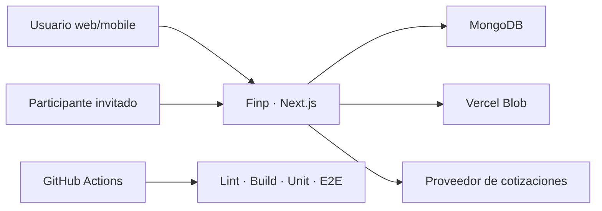
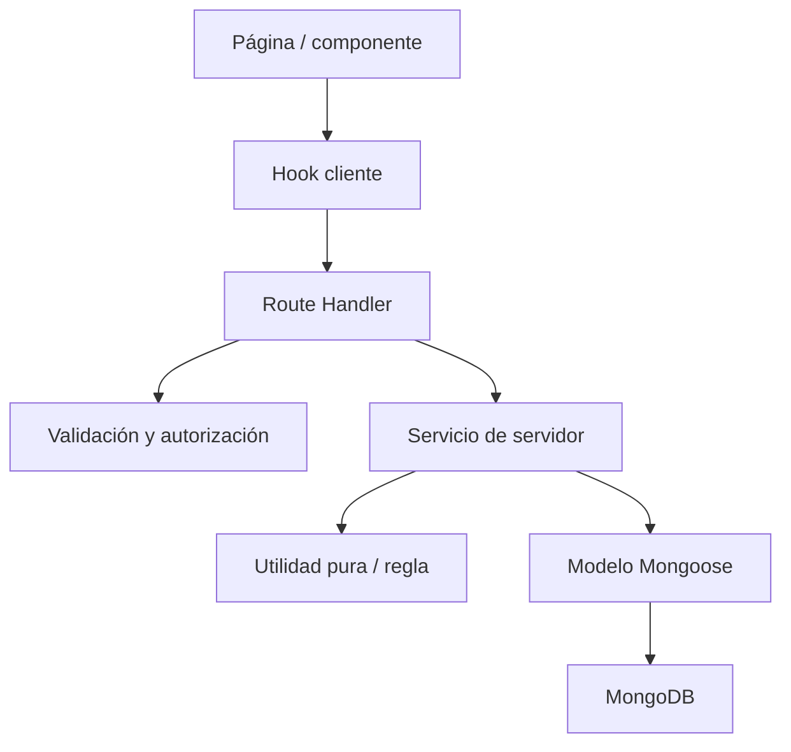

# Arquitectura técnica de Finp

> Estado: vigente
> Audiencia: desarrollo, arquitectura, calidad y agentes
> Última actualización: 2026-08-25
> Fuente de verdad: estructura técnica, límites y fuentes de datos

## Índice

1. [Objetivo](#1-objetivo)
2. [Contexto del sistema](#2-contexto-del-sistema)
3. [Stack](#3-stack)
4. [Estructura del repositorio](#4-estructura-del-repositorio)
5. [Capas y dependencias](#5-capas-y-dependencias)
6. [Flujo de una operación](#6-flujo-de-una-operación)
7. [Fuentes de verdad por dominio](#7-fuentes-de-verdad-por-dominio)
8. [Servicios de servidor](#8-servicios-de-servidor)
9. [Persistencia](#9-persistencia)
10. [Consistencia y atomicidad](#10-consistencia-y-atomicidad)
11. [Autenticación, autorización y privacidad](#11-autenticación-autorización-y-privacidad)
12. [Cliente, cache e invalidación](#12-cliente-cache-e-invalidación)
13. [Errores y observabilidad](#13-errores-y-observabilidad)
14. [Automatización y aprendizaje](#14-automatización-y-aprendizaje)
15. [Rendimiento](#15-rendimiento)
16. [Migraciones y compatibilidad](#16-migraciones-y-compatibilidad)
17. [Plataforma futura](#17-plataforma-futura)
18. [Reglas de evolución](#18-reglas-de-evolución)

## 1. Objetivo

Este documento describe cómo se organiza Finp y dónde deben vivir las responsabilidades. La especificación funcional define comportamiento; este documento evita duplicación, acoplamiento y fuentes de verdad contradictorias.

## 2. Contexto del sistema



Finp es actualmente un monolito modular:

- una aplicación Next.js;
- UI y API en el mismo repositorio;
- MongoDB como persistencia principal;
- servicios de dominio compartidos en servidor;
- integraciones externas acotadas.

No existe hoy:

- backend separado;
- cola de eventos;
- scheduler operativo;
- realtime;
- base local sincronizada;
- cliente mobile nativo.

## 3. Stack

| Área | Tecnología |
|---|---|
| Framework | Next.js App Router 16 |
| UI | React 19, TypeScript, Tailwind CSS, Radix/shadcn y componentes propios |
| Formularios | React Hook Form y Zod |
| Persistencia | MongoDB y Mongoose |
| Autenticación | NextAuth v5 beta |
| Datos cliente | Hooks propios, fetch e invalidación por tags |
| Visualización | Recharts, D3 y d3-sankey |
| Archivos | ExcelJS/xlsx y Vercel Blob |
| Unit/integration | Vitest y Testing Library |
| E2E | Playwright |
| CI | GitHub Actions |

La versión exacta vive en `package.json` y `package-lock.json`.

## 4. Estructura del repositorio

```text
src/
├── app/
│   ├── (app)/              páginas autenticadas
│   ├── (auth)/             login y registro
│   └── api/                Route Handlers
├── components/
│   ├── ui/                 primitivas
│   ├── shared/             componentes de producto reutilizables
│   └── <dominio>/          composición por módulo
├── contexts/               contexto React global
├── hooks/                  acceso cliente e interacción
├── lib/
│   ├── client/             sincronización y utilidades cliente
│   ├── constants/          constantes compartidas
│   ├── db/                 conexión
│   ├── models/             modelos Mongoose
│   ├── server/             servicios de servidor y dominio
│   ├── utils/              lógica pura
│   └── validations/        esquemas de entrada
└── types/                  contratos compartidos
```

Tests:

```text
tests/
├── unit/
├── e2e/
└── helpers/
```

## 5. Capas y dependencias

Dirección esperada:



Reglas:

- componentes no importan modelos Mongoose;
- hooks no contienen reglas financieras;
- Route Handlers no duplican servicios;
- servicios coordinan autorización de recursos, dominio y persistencia;
- utilidades puras no acceden a red ni base;
- validaciones representan contratos de entrada, no decisiones completas de negocio;
- tipos compartidos no deben arrastrar dependencias de servidor al cliente.

Una excepción necesita justificación y, si crea precedente, una decisión.

## 6. Flujo de una operación

### Consulta

1. UI solicita datos mediante hook o fetch.
2. Route Handler autentica.
3. Servicio filtra por usuario y permisos.
4. Modelos leen datos.
5. Servicio transforma a un contrato seguro.
6. Cliente presenta y conserva estados de carga/error.

### Mutación

1. UI recoge intención.
2. Cliente puede validar para feedback.
3. Servidor vuelve a validar.
4. Se autentica y autoriza el recurso.
5. Servicio resuelve reglas e invariantes.
6. Se escriben cambios atómicos si corresponde.
7. Se generan efectos derivados idempotentes.
8. Se devuelve resultado.
9. Cliente invalida tags relacionados.
10. UI confirma impacto o error.

La preview ejecuta resolución sin persistir. La confirmación vuelve a validar datos que pudieron cambiar.

## 7. Fuentes de verdad por dominio

| Dominio | Fuente principal | Regla |
|---|---|---|
| Usuario/preferencias | `User` | Aislamiento por identidad autenticada. |
| Saldo de cuentas | transacciones + saldos iniciales | No guardar un saldo derivado como autoridad paralela. |
| Movimiento personal | `Transaction` | Tipo y vínculos determinan efecto. |
| Resumen de tarjeta | transacciones del período + `credit-card.ts` | Total, pagado, pendiente y crédito se derivan por tarjeta y moneda; nunca se suman ARS y USD. |
| Grupo de pago dual | `Transaction.paymentGroupId` | Vincula una intención de pago; el usuario elige el alcance del borrado y un grupo con menos de dos miembros se normaliza. |
| Cuotas | `InstallmentPlan` + transacciones relacionadas | Evitar doble impacto. El plan vive mientras exista su compra originaria: eliminar una arrastra la otra. |
| Compromiso | `ScheduledCommitment` | Plantilla, política y agenda. |
| Aplicación | subdocumento/relación de compromiso | Snapshot por período y transacción. |
| Regla | `TransactionRule` | Servicio compartido resuelve coincidencia y acciones. |
| Aprendizaje | perfil, eventos, alias y control de patrones | Menor autoridad que entrada explícita y reglas. |
| Espacio | `Space`, participantes y `SpaceEntry` | En contrato v2, el movimiento contiene sólo contexto compartido, dinero exacto, día financiero y snapshots. La moneda de reporte no reemplaza la original. |
| Impacto personal | `SpaceEntryPersonalImpact` | Privado por usuario; parte propia, impacto real y operacional son magnitudes explícitas. No usar estado global `linked`. |
| Deuda | `Debt` + `DebtMovement` | Manual o derivada; el ledger de Espacios por moneda manda sobre la derivada. El dinero pagado y el aplicado se conservan separados y no tienen impacto operacional. |
| Notificación | `Notification` | Información y presentación. |
| Pendiente | entidad de acción correspondiente | No se resuelve por leer notificación. |

## 8. Servicios de servidor

Servicios relevantes en `src/lib/server/`:

| Grupo | Responsabilidad |
|---|---|
| `transactions.ts` | creación y edición de movimientos con reglas comunes |
| `transaction-teardown.ts` | operación transaccional de borrado autorizado: lee con alcance de usuario, limpia relaciones, elimina y normaliza grupos; incluye cascada de cuotas e impactos de Espacios |
| `commitments*.ts` | políticas de monto, contexto, matching y aplicación |
| `projection.ts` | proyección compartida por API y superficies |
| `quick-capture*.ts` | contexto, preview, aprendizaje y feedback |
| `spaces.ts` y servicios legacy `space-*.ts` | contrato vigente de permisos, movimientos, actividad, invitaciones e impacto durante la compatibilidad |
| `space-*-service-v2.ts` | servicios de aplicación para movimiento, historia, impacto privado, liquidación y administración, compartidos por las rutas existentes |
| `space-operation-executor.ts` | transacción MongoDB, idempotencia de intención y referencias de resultado de Espacios v2 |
| `money.ts` e `iso-currencies.ts` | `MoneyDto`, registro ISO de curso legal, conversión exacta, redondeo y reparto por restos mayores |
| `space-financial-v2.ts` | reparto, día financiero, impactos y balances puros por moneda en unidades menores exactas |
| `space-quote-service.ts` | lote de referencias DolarAPI/Frankfurter, cache, caminos directos o derivados, snapshots manuales y conflictos por antigüedad o cambio |
| `space-settlement-allocator-v2.ts` | aplicación determinista de tramos contra componentes de deuda, primero en la misma moneda y luego mediante conversiones explícitas |
| `space-debt-materialization-v2.ts` | ledger y materialización de deudas y movimientos separados por moneda dentro de la sesión financiera |
| `space-legacy-adapter.ts` | lectura determinista del estado legacy sin convertir ambigüedad en autoridad v2 |
| `space-read-service-v2.ts` y `space-api-contract.ts` | DTOs JSON, capacidades y paginación por cursor; errores y mutaciones normalizados |
| `space-v2-write-gate.ts` y `space-legacy-write-facade.ts` | activación exclusiva en `finp-e2e` y frontera que impide fallback v2 hacia escrituras legacy |
| `migrations/space-v2-migration-*.ts` | contratos, clasificación fail-closed, fingerprint, sanitización, copia por lotes, preimágenes, backfill por Espacio, verificación y rollback del ensayo v2 |
| `debt-sync.ts` | materialización idempotente desde Espacios |
| `debt-settlement.ts` | pago/cobro atómico |
| `notifications.ts` | creación, dedupe y resolución |
| `nav-insights.ts` | señales de navegación |
| `errors.ts` | errores de servicio traducibles por API |

Antes de crear un servicio:

1. buscar una responsabilidad equivalente;
2. extender la fuente común;
3. evitar una versión “especial” en un endpoint;
4. agregar tests sobre el servicio compartido.

## 9. Persistencia

### Modelos

Mongoose modela entidades principales y relaciones por identificador. Los modelos deben:

- definir índices según consultas reales;
- incluir `userId` o contexto de autorización;
- evitar campos derivados como autoridad duplicada;
- validar enums y estados;
- preservar compatibilidad durante migraciones.

### Cache de modelos

En desarrollo, Mongoose puede conservar modelos compilados. Al agregar campos se debe revisar el guard de refresco de schema; de lo contrario un campo puede descartarse silenciosamente.

### Archivos

Los adjuntos persistentes usan Vercel Blob. La base conserva metadata y relación, no el archivo binario.

### Fechas

- Guardar fechas de forma consistente.
- Interpretar período con zona horaria definida.
- Los rangos financieros son semiabiertos `[start, end)`.
- Consultas migradas desde finales inclusivos deben usar `$lt`, no `$lte`.

## 10. Consistencia y atomicidad

Usar una transacción de base cuando el fallo parcial dejaría dinero o estado inconsistente.

Casos:

- pago/cobro de deuda + movimiento;
- aplicación de compromiso + transacción + snapshot;
- acciones multi-entidad que no pueden confirmarse parcialmente.

En Espacios v2, una intención financiera se identifica por actor, Espacio, tipo
de operación y hash de una clave idempotente. `SpaceOperation` y todas las
escrituras financieras se confirman en la misma sesión MongoDB. Un reintento con
la misma carga devuelve las referencias confirmadas; la misma clave con otra
carga produce conflicto. Alta, edición, anulación, impacto personal, liquidación,
deuda, actividad y pendientes no usan compensación manual.

Las notificaciones son presentación posterior al commit: se derivan de impactos
`pending` o `needs_review`, admiten reconciliación observable y no repiten la
operación financiera. Edición, anulación, roles, ownership y modo de deuda exigen
la revisión esperada para evitar sobrescritura silenciosa.

Los importes v2 no usan `number` como autoridad persistida. `MoneyDto` transporta
moneda, unidades menores como entero decimal y escala ISO. Cada conversión
confirmada conserva un `ConversionSnapshot`: el gasto histórico se lee con ese
snapshot y una posición abierta se puede revaluar por separado.

Una liquidación multimoneda registra componentes objetivo, varios tramos y sus
aplicaciones. Cada aplicación distingue dinero pagado, dinero aplicado y
conversión. Movimiento compartido, `Debt`, `DebtMovement`, actividad y
decisiones privadas se confirman atómicamente; una liquidación confirmada se
revierte y no se edita en sitio.

Los diez índices v2 viven en un manifiesto explícito y no dependen de
`autoIndex`. Durante esta etapa sólo se aplican en la base E2E aislada;
development admite validación `dry-run` y producción se rechaza. Los índices
parciales por `contractVersion: 2` preservan la lectura de documentos legacy.

Los efectos derivados deben:

- tener clave de idempotencia natural o explícita;
- tolerar reintentos;
- detectar entidades existentes;
- resolver o reportar inconsistencias.

No borrar por inferencia relaciones ambiguas que también muevan dinero. Cuando
la relación es conocida, la API expone alcances explícitos y el usuario elige.
El pago dual admite `single` y `group`; el primer alcance conserva la otra parte
y elimina su identificador de grupo huérfano.

`DELETE /api/transactions/:id` y la baja del impacto personal de Espacios usan
la misma operación. Sus selectores siempre incluyen `userId`; el segundo agrega
`spaceId` y `spaceEntryId`, de modo que una transacción huérfana sólo se resuelve
por identidad exacta. Lectura, teardown, borrado y normalización se ejecutan en
una sesión MongoDB. Un fallo revierte la unidad completa y se informa sin
registrar contenido financiero.

## 11. Autenticación, autorización y privacidad

### Autenticación

NextAuth identifica al usuario. Cada Route Handler protegido debe obtener sesión y rechazar acceso no autenticado.

### Autorización

Cada recurso se filtra por:

- `userId` para finanzas personales;
- pertenencia y rol para Espacios;
- token válido y exposición mínima para invitaciones.

No confiar en IDs enviados por cliente sin comprobar propiedad.

### Privacidad

- El cliente recibe sólo datos necesarios.
- Datos personales de un participante no se exponen al Espacio.
- Telemetría de aprendizaje evita frase, monto, fecha y notas.
- Tokens de invitación se almacenan hasheados.
- Errores y logs no incluyen secretos ni datos financieros libres.

## 12. Cliente, cache e invalidación

Los hooks encapsulan carga, mutación y estados del cliente. `data-sync` coordina invalidación por tags.

Reglas:

- una mutación invalida todas las superficies derivadas;
- evitar refrescos globales si tags específicos alcanzan;
- polling sólo para señales que necesitan actualización periódica;
- refrescar por foco/visibilidad de manera controlada;
- deduplicar solicitudes;
- conservar borradores ante errores recuperables;
- no guardar datos financieros sensibles en URLs.

Los borradores entre funciones usan `sessionStorage`, versión y un ID opaco en la URL.

## 13. Errores y observabilidad

Capas:

1. utilidad pura: resultado o error tipado;
2. servicio: error de dominio con contexto seguro;
3. API: estado HTTP y contrato estable;
4. UI: mensaje accionable y recuperación.

Categorías:

- validación;
- no autenticado;
- no autorizado;
- no encontrado;
- conflicto;
- saldo o estado incompatible;
- dependencia externa;
- interno.

Una operación debe indicar si:

- no comenzó;
- falló sin escribir;
- se confirmó pero falló un refresco secundario;
- necesita revisión.

Observabilidad futura debe medir errores y rendimiento sin registrar contenido financiero sensible.

## 14. Automatización y aprendizaje

Arquitectura de autoridad:

```text
entrada explícita
  > alias
  > regla administrada
  > patrón aprendido
  > default
```

Separar:

- interpretación determinista;
- preview;
- resolución de reglas;
- ranking personal;
- feedback;
- escritura financiera.

El aprendizaje no escribe operaciones por sí mismo. Las sugerencias funcionales transportan intención al módulo responsable.

Captura rápida clasifica las intenciones financieras especializadas de forma
determinista antes de habilitar una escritura simple. Los contratos
discriminados separan compromiso, compra con tarjeta, pago y revisión de cuota.
Sólo la compra en un pago se confirma localmente; cuotas y pagos atraviesan el
formulario de Transacciones y los servicios existentes. La creación de planes
devuelve plan y transacción padre para permitir trazabilidad y rollback.

Todo nuevo destino de orientación necesita:

- tipo de intención;
- borrador tipado y versionado;
- procedencia por campo;
- validación en destino;
- evento de aceptación y finalización;
- descarte cuando el dominio admita una alternativa segura;
- tests mobile/desktop.

## 15. Rendimiento

Áreas de riesgo:

- agregaciones históricas de saldos;
- proyección;
- polling de notificaciones;
- listas grandes de transacciones;
- bundle de gráficos e iconos;
- aprendizaje sobre historial;
- adjuntos;
- futuros procesos recurrentes.

Prácticas:

- índices basados en consultas;
- proyección en servidor;
- paginación o ventanas;
- imports selectivos y lazy loading;
- evitar trabajo financiero repetido en cada render;
- medir bundle y rutas antes/después;
- definir presupuesto cuando exista una línea base;
- presentar alternativas si una solución requiere infraestructura o costo nuevo.

No agregar cache derivada sin estrategia de invalidación.

Las referencias externas de Espacios son una excepción acotada: DolarAPI usa
cache de 15 minutos y Frankfurter su frecuencia diaria. La interfaz solicita un
lote por Espacio al recuperar foco y cada 15 minutos sólo con pestaña visible;
nunca realiza una consulta por movimiento. La caída del proveedor conserva las
monedas originales y no habilita un agregado parcial como total exacto.

## 16. Migraciones y compatibilidad

Toda migración:

- identifica ambiente;
- tiene `dry-run` cuando escribe datos importantes;
- es idempotente;
- informa cantidad y anomalías;
- no toca otras cuentas o contextos;
- permite backup o recuperación;
- conserva compatibilidad durante el despliegue;
- documenta retiro del legado.

Para Espacios, `migrate:spaces:v2` concentra `plan`, `clone`, `apply`, `verify`
y `rollback`. Cada subcomando es `dry-run` por defecto y sólo admite escritura
con `--execute` contra una base nueva con marcador `e2e-migration`. La fuente de
development se lee dentro de un snapshot abortado y exige confirmación exacta.

El plan vincula commit, auditoría, snapshot, copia y manifiesto mediante
fingerprints. La copia conserva IDs, importes, monedas, fechas y relaciones,
pero anonimiza identidad, texto libre, credenciales, tokens, adjuntos y URLs.
Cada Espacio se transforma en su propia transacción; sus preimágenes tienen
checksum y el rollback restaura por lotes el fingerprint anterior exacto.

La activación futura es por Espacio. `contractVersion: 2` se confirma al final
de la transacción verificada y desde entonces la fachada legacy no es una salida
válida. Un agregado no elegible queda en sólo lectura, sin balances parciales.
El contrato público sólo expone estado y motivo seguro; nunca metadata interna
de migración. La autoridad completa está en la
[`decisión 0010`](../decisiones/0010-migracion-progresiva-espacios-v2.md).

Compatibilidad conocida:

- campos legacy de vinculación en Espacios;
- datos previos a políticas variables de compromisos;
- relaciones incompletas entre transacciones y cuotas.

Los campos monetarios exactos y los índices multimoneda permanecen limitados a
`contractVersion: 2` en `finp-e2e`. El ensayo `e2e-migration` no modifica esta
regla: development no recibió backfill ni cutover y producción permanece fuera
de alcance hasta aprobar FINP-P0-006.

El roadmap contiene la prioridad de limpieza.

## 17. Plataforma futura

Antes de elegir una estrategia Android/iOS se deben conocer:

- uso offline requerido;
- notificaciones;
- capacidades de dispositivo;
- seguridad local;
- sincronización y conflictos;
- reutilización real de UI y dominio;
- costo de mantenimiento;
- distribución y actualizaciones.

La elección requiere una decisión registrada. La arquitectura web no debe cerrarse a una API futura, pero tampoco construir una abstracción mobile especulativa.

## 18. Reglas de evolución

- Una regla financiera vive en un servicio compartido.
- Un módulo conserva autoridad sobre su confirmación.
- Las relaciones privadas no se elevan a estado global.
- Una automatización se puede explicar y controlar.
- Un cambio histórico usa snapshot o migración explícita.
- Una dependencia estructural requiere evaluación.
- Una operación costosa presenta alternativas.
- Un patrón transversal se documenta.
- Una fuente reemplazada se retira o archiva.
- Arquitectura, tests y documentación evolucionan en la misma entrega.
